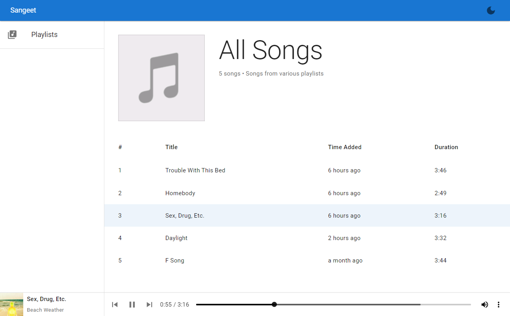
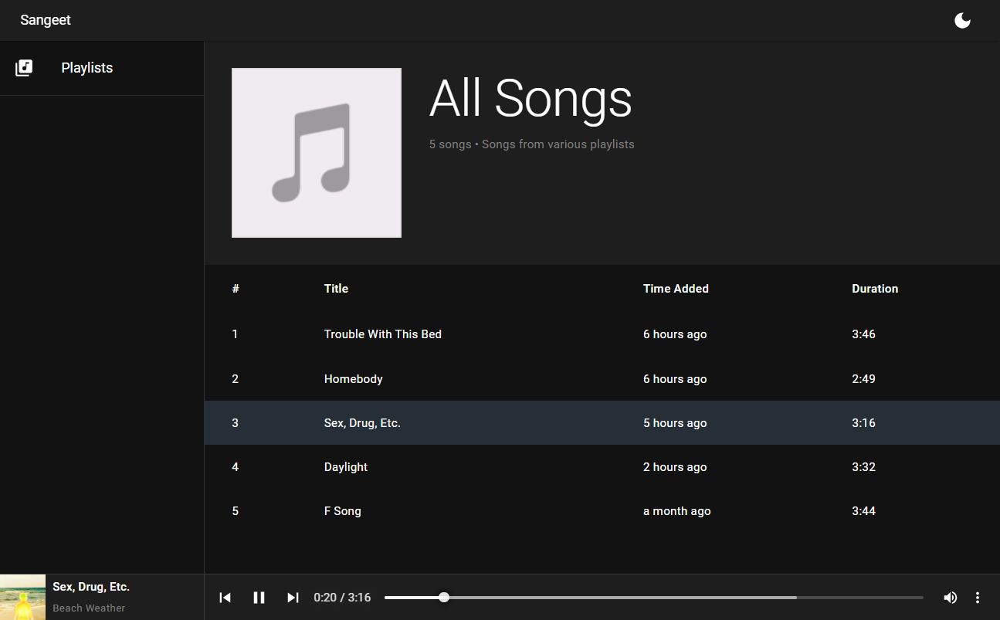

# Sangeet
A spotify clone mini project with MERN Stack written in typescript, it uses the `fs` node module to create a read stream from the file on the server inside `media` directory and send it to client with proper html header to provide music streaming.

## Technologies Used

# Screenshots

